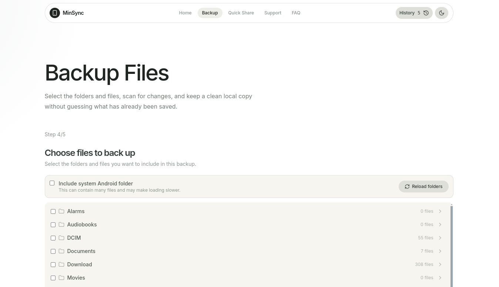

# MinSync

MinSync is a cross-platform Electron desktop app for backing up Android phones and sharing files between a phone and computer.

## Support the project

- [GitHub Sponsors](https://github.com/sponsors/project59)
- [Buy Me a Coffee](https://buymeacoffee.com/project59)

## Features

- Incremental Android backups over ADB
- Browse phone folders and choose what to back up
- Compare phone files with files already on your computer
- Quick Share for transferring files over the same Wi-Fi network
- Available for Linux, macOS, and Windows

## Download

Open the [latest release](https://github.com/project59/minsync/releases/latest) in the GitHub **Releases** tab and download the file for your platform:

- **Linux:** `.AppImage` for a portable app, or `.deb` for Debian-based distributions
- **macOS:** `.dmg` installer, or `.zip`
- **Windows:** the **portable `.exe`** is recommended; an NSIS installer is also available

## Local development

Requirements:

- Node.js 22 or newer
- Linux, macOS, or Windows

Install dependencies and start the Electron app in development mode:

```bash
npm install
npm run dev
```

`npm install` downloads the platform-specific Android Platform Tools into `bin/`. MinSync uses this bundled ADB first and falls back to an `adb` executable on your `PATH`.

Build the renderer:

```bash
npm run build
```

Create local packages with `npm run dist:linux`, `npm run dist:mac`, or `npm run dist:win`. Build output is written to `release/`.
